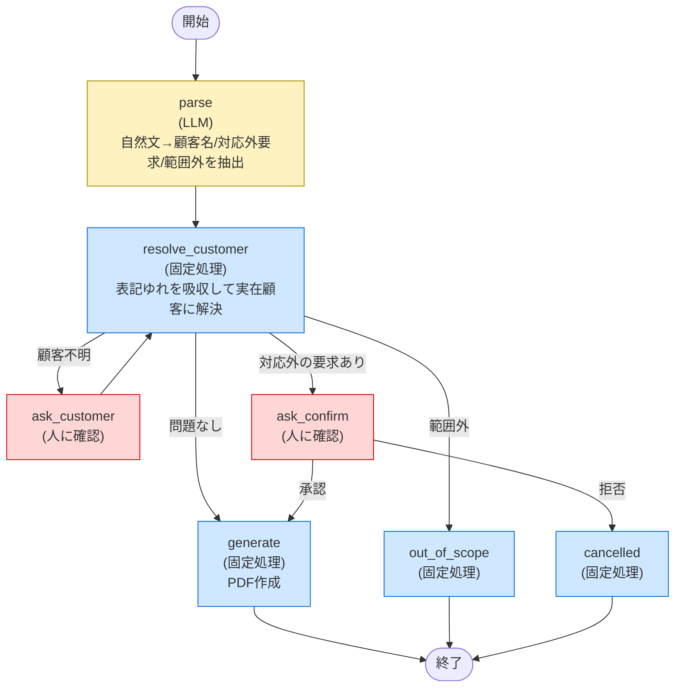

# ゲート3: 構造化する

## ワークフロー図

- 黄色 = LLMの判断（`parse`のみ）
- 青 = 決定的なコード処理
- 赤 = 人間への確認（Human-in-the-Loop、実行前の承認ゲート）

## なぜここをLLMに任せなかったか

ゲート1の設計（LLMに直接ツールを呼ばせる）では、ゲート2で次の問題が出た。

| 問題 | 原因 |
| --- | --- |
| 存在しないツールを呼んでクラッシュ（#21） | ツール選択・実行までLLM任せだった |
| 対応してない機能を「対応した」と嘘の報告（#18, #24） | 実行結果の説明文までLLMが自由に生成していた |
| 割引の要求を無視したまま無確認で確定（#15） | 実行の可否判断までLLM任せだった |

そこで、LLMの役割を「自然文から情報を抜き出す」の一点に絞った。

- **顧客名の解決**（表記ゆれの吸収）は`difflib`によるコード側の決定的な処理にした。LLMの「気分」で毎回結果が変わるのを防ぐため
- **実行してよいかの判断**（対応外の要求がある／顧客が特定できない）はコードの条件分岐にした。ここをLLMに委ねると、ゲート2のように無確認で実行したり、実行したふりをしたりする
- **最終的にユーザーに見せる文章**は必ずコードで組み立てる。LLMには「何が実行されたか」を語らせない。これによりハルシネーション（嘘の完了報告）を構造的に防いでいる
- LLMに残したのは「自然文の揺れを吸収して意図を抜き出す」という、そもそもLLMが得意で、かつ間違えても実害が小さい（せいぜい聞き返しが増えるだけ）部分だけ

## 状態管理・チェックポイントの検証

`SqliteSaver`を使い、会話の状態を`checkpoints.sqlite`に保存するようにした。

実際に「プロセスAが質問を出して終了 → 別プロセスBが起動して続きから再開」を検証済み。同じ`thread_id`であれば、最初からのやり直しにならず、保留していた質問の続きから再開できることを確認した。

## 未対応のまま残した点（意図的なスコープ外）

- 「さっきの続きで」のような複数ターンをまたいだ会話の文脈記憶（ゲート2 #7）は今回は対応していない。都度「どの顧客か」を聞き返す形で安全側に倒しているため、実害はない
